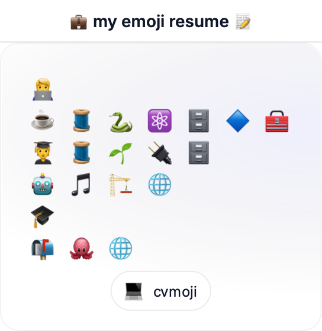

# cvmoji — Emoji Resume Generator

Turn resume text or PDFs into a clean, sharable emoji card. Paste your resume, tweak the lines, and export a crisp PNG — perfect for profiles, portfolios, and quick intros.

Example Resume
```
Japinder Narula — Software Engineer
Skills: Java, Kotlin, Python, React, SQL, Azure, Git
Experience: LegalZoom — SWE Intern — Kotlin, Spring Boot, REST, SQL, PostgreSQL
Projects: LSTM music generator; Portfolio website
Education: B.S. Electrical Engineering and Computer Science
Contact: github.com/japinder12 • website • email
```



### Screenshot of the site


## Highlights
- Meaningful mapping: frameworks and tools beat base languages (⚛️ over ✨), Redis is 🧱 not a red square.
- Smart caps by section: Skills show more; Experience/Projects stay concise.
- Balanced rows: merges consecutive single‑emoji lines, but keeps multi‑emoji lines intact.
- Accessible dark mode: toggle with a single key.
- Responsive: works on mobile.
- Quick actions: copy emojis, export PNG, export SVG (vector), and share a permalink (state in URL hash).
- Friendly parsing: handles single-line blobs and PDFs; splits on bullets, pipes, semicolons, and common section headers.

### Exports
- PNG: raster export with a composed header bar for a consistent shareable frame.
- SVG: same box size/framing as PNG but in vector quality. Watermark appears only on export, not in the live preview.

## How It Works
- Parser splits text into logical lines (bullets/pipes/section headers), then maps tech/keywords to emojis with scoring and section-aware caps.
- A global repetition cap prevents spammy repeats across the whole card.
- Emojis are reflowed into balanced rows (4/6/8 per row), reducing fragmenting.

## Keyboard Shortcuts
- Copy emojis: ⌘/Ctrl+Shift+C
- Export PNG: ⌘/Ctrl+E
- Copy permalink: ⌘/Ctrl+Shift+S


## Quick Start

Dev
```
npm i
npm run dev
```

Build
```
npm run build
```

Deploy
- Vercel (recommended): import repo, framework = Vite.
- Any static host: serve `dist/` after build.
