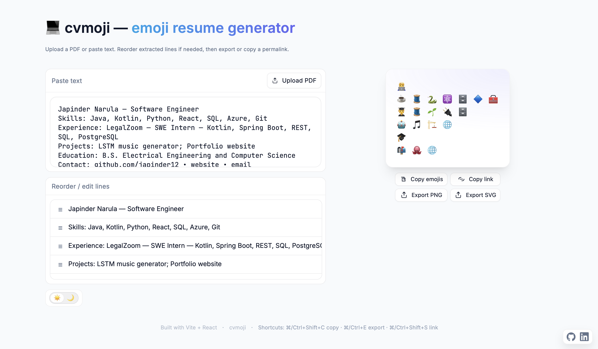

# cvmoji — Emoji Resume Generator

Turn resume text or PDFs into a clean, sharable emoji card. Paste your resume, tweak the lines, and export a crisp PNG — perfect for profiles, portfolios, and quick intros.


### Screenshot of the site



## Highlights
- Meaningful mapping: frameworks and tools beat base languages (⚛️ over ✨), Redis is 🧱 not a red square.
- Smart caps by section: Skills show more; Experience/Projects stay concise.
- 1:1 line mapping: one emoji row per input line for easy tracking.
- Accessible dark mode: toggle with a single key.
- Responsive: works on mobile.
- Quick actions: copy emojis, export PNG, and share a permalink (state in URL hash).
- Friendly parsing: handles single-line blobs and PDFs; splits on bullets, pipes, semicolons, and common section headers.

## How It Works
- Parser splits text into logical lines (bullets/pipes/section headers), then maps tech/keywords to emojis with scoring and section-aware caps.
- Frameworks demote base language emojis to keep output specific.
- Output preserves your line structure; exports match on-screen lines.

## Keyboard Shortcuts
- Copy emojis: ⌘/Ctrl+Shift+C
- Export PNG: ⌘/Ctrl+E
- Copy permalink: ⌘/Ctrl+Shift+S


## Quick Start

Dev
```
npm i
npm run dev
```

Build
```
npm run build
```

Deploy
- Vercel (recommended): import repo, framework = Vite.
- Any static host: serve `dist/` after build.
